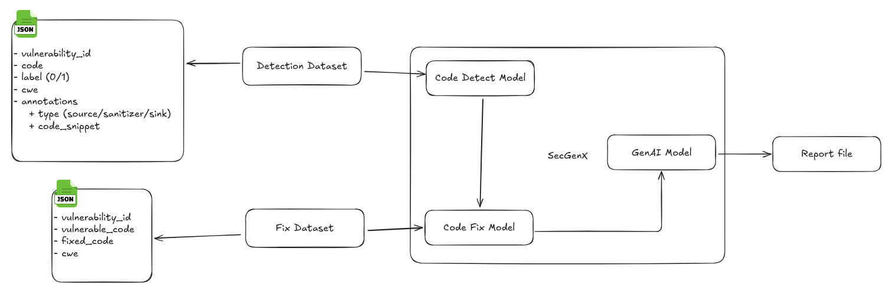

#### 1. Mục tiêu của hệ thống
- ```Mô hình Phát hiện (Detection Model)```: Nhận mã nguồn làm đầu vào, phân tích và xác định chính xác có lỗ hổng hay không và vị trí của nó (```source```, ```sink```).

- ```Mô hình Sửa lỗi (Remediation Model)```: Nhận đoạn mã lỗi từ Mô hình 1 và tạo ra phiên bản đã được vá lỗi.
- ```GenAI Model```: Nhận đầu ra của 2 mô hình mà đưa ra giải thích, cách hacker tấn công vào lỗ hổng này và thuyết phục lý do sử dụng mã được đề xuất

#### 2. Nguyên tắc cốt lõi: AI học "Luồng dữ liệu"
=> Học cách nhận diện mẫu hình của luồng dữ liệu (Data Flow Pattern): 
- ```Source```: Nó học cách nhận biết các điểm nhập dữ liệu không đáng tin cậy (ví dụ: ```@RequestParam```, ```request.getParameter```).
- ```Flow```: Nó học cách theo dõi đường đi của dữ liệu này qua các biến và lời gọi hàm, dù trong một hay nhiều file.
- ```Sink```: Nó học cách nhận biết các hàm nguy hiểm nơi dữ liệu chưa qua xử lý có thể gây ra lỗi (ví dụ: ```new File()```, ```Statement.executeQuery()```).

#### 3. Blueprint cho Dataset Tối ưu
=> cấu trúc dataset tối ưu nhất : 2 bộ dataset được liên kết với nhau bằng một ```vulnerability_id``` cho mỗi cặp lỗi/fix
##### File 1: Detection Dataset -> Code Detect Model 
- ```Nguồn dữ liệu```: Được lấy từ các source code có chứa mã độc và được quét qua Snyk để ra được ```annotations[label]: 1``` và sau đó copy code từ các file chứa lỗi đó theo ```Data Flow``` paste vào Gemini để sinh ra ```annotations[label]: 0```
- ```Mục đích```: Dạy cho AI sự tương phản giữa code an toàn và code chứa lỗi
- ```Cấu trúc```: Mỗi cặp lỗi/fix sẽ tạo ra hai dòng dữ liệu.
- ```Trường code```: Chứa mã nguồn đã được ```làm phẳng (flattened)``` để cung cấp đầy đủ ngữ cảnh luồng dữ liệu, đặc biệt với các lỗi đa file.
- ```Trường annotations```:
  * Với ```label: 1``` (lỗi): Chú thích ```source``` và ```sink``` bằng các đoạn mã cụ thể.
  ```json
  {
    "vulnerability_id": "PTE-002",
    "code": "@GetMapping(\"/PathTraversal/random-picture\")\n@ResponseBody\npublic ResponseEntity<?> getProfilePicture(HttpServletRequest request) {\n    var queryParams = request.getQueryString();\n    if (queryParams != null && (queryParams.contains(\"..\") || queryParams.contains(\"/\"))) {\n        return ResponseEntity.badRequest()\n            .body(\"Illegal characters are not allowed in the query params\");\n    }\n    try {\n        var id = request.getParameter(\"id\");\n        var catPicture =\n            new File(catPicturesDirectory, (id == null ? RandomUtils.nextInt(1, 11) : id) + \".jpg\");\n\n        if (catPicture.getName().toLowerCase().contains(\"path-traversal-secret.jpg\")) {\n            return ResponseEntity.ok()\n                .contentType(MediaType.parseMediaType(MediaType.IMAGE_JPEG_VALUE))\n                .body(FileCopyUtils.copyToByteArray(catPicture));\n        }\n        if (catPicture.exists()) {\n            return ResponseEntity.ok()\n                .contentType(MediaType.parseMediaType(MediaType.IMAGE_JPEG_VALUE))\n                .location(new URI(\"/PathTraversal/random-picture?id=\" + catPicture.getName()))\n                .body(Base64.getEncoder().encode(FileCopyUtils.copyToByteArray(catPicture)));\n        }\n        return ResponseEntity.status(HttpStatus.NOT_FOUND)\n            .location(new URI(\"/PathTraversal/random-picture?id=\" + catPicture.getName()))\n            .body(\n                StringUtils.arrayToCommaDelimitedString(catPicture.getParentFile().listFiles())\n                    .getBytes());\n    } catch (IOException | URISyntaxException e) {\n        log.error(\"Image not found\", e);\n    }\n\n    return ResponseEntity.badRequest().build();\n}",
    "label": 1,
    "cwe": "CWE-22",
    "annotations": [
      {
        "type": "source",
        "code_snippet": "var id = request.getParameter(\"id\");"
      },
      {
        "type": "sink",
        "code_snippet": "new File(catPicturesDirectory, (id == null ? RandomUtils.nextInt(1, 11) : id) + \".jpg\");"
      }
    ]
  }
  ```
  * Với ```label: 0``` (an toàn): Chú thích ```source```, ```sanitizer``` (bước vá lỗi), và ```sink``` để dạy AI tại sao code đó lại an toàn
  ```json
  {
    "vulnerability_id": "PTE-002",
    "code": "@GetMapping(\"/PathTraversal/random-picture/safe\")\n@ResponseBody\npublic ResponseEntity<?> getProfilePictureSafe(HttpServletRequest request) {\n    try {\n        String id = request.getParameter(\"id\");\n        String filename = (id == null) ? String.valueOf(RandomUtils.nextInt(1, 11)) : id;\n\n        // SANITIZER: Loại bỏ các ký tự đường dẫn và chỉ giữ lại tên file.\n        String cleanFilename = org.apache.commons.io.FilenameUtils.getName(filename);\n        if (cleanFilename.contains(\"..\")) {\n             return ResponseEntity.badRequest().build();\n        }\n\n        File catPicture = new File(catPicturesDirectory, cleanFilename + \".jpg\");\n\n        // SANITIZER: Kiểm tra xem đường dẫn cuối cùng có nằm trong thư mục cho phép không.\n        if (!catPicture.getCanonicalPath().startsWith(catPicturesDirectory.getCanonicalPath())) {\n            return ResponseEntity.status(HttpStatus.FORBIDDEN).build();\n        }\n\n        // ... (Phần logic còn lại để trả về file an toàn) ...\n        if (catPicture.exists()) {\n            return ResponseEntity.ok()\n                .contentType(MediaType.parseMediaType(MediaType.IMAGE_JPEG_VALUE))\n                .body(Base64.getEncoder().encode(FileCopyUtils.copyToByteArray(catPicture)));\n        }\n    } catch (IOException e) {\n        log.error(\"Image not found\", e);\n    }\n    return ResponseEntity.badRequest().build();\n}",
    "label": 0,
    "cwe": "CWE-22",
    "annotations": [
      {
        "type": "source",
        "code_snippet": "String id = request.getParameter(\"id\");"
      },
      {
        "type": "sanitizer",
        "code_snippet": "String cleanFilename = org.apache.commons.io.FilenameUtils.getName(filename);"
      },
      {
        "type": "sink",
        "code_snippet": "File catPicture = new File(catPicturesDirectory, cleanFilename + \".jpg\");"
      }
    ]
  }
  ```
##### File 2: Fix Dataset -> Code Fix Model
- ```Nguồn dữ liệu```: Yêu cầu Gemini tạo các mã lỗi và mã fix
- ```Mục đích```: Dạy cho AI quy tắc biến đổi từ code lỗi sang code an toàn.
- ```Cấu trúc```: Mỗi cặp lỗi/fix chỉ tạo ra một dòng dữ liệu.
```Các trường chính```: ```vulnerable_code``` (input) và ```fixed_code``` (output).
```json
{
  "vulnerability_id": "PTE-002",
  "vulnerable_code": "/* TOÀN BỘ mã nguồn của phương thức getProfilePicture gốc... */",
  "fixed_code": "/* TOÀN BỘ mã nguồn của phương thức getProfilePictureSafe đã sửa lỗi... */",
  "cwe": "CWE-22"
}
```
##### Model GenAI
- ```Đầu vào```: ```cwe ```, ```full_vulnerable_method```, và ```fixed_code```.
- Prompt
  ```markdown
  Bạn là một chuyên gia bảo mật AI hàng đầu, có khả năng giải thích các vấn đề kỹ thuật phức tạp cho lập trình viên một cách rõ ràng, súc tích và mang tính xây dựng.

  Dưới đây là thông tin về một lỗ hổng bảo mật được phát hiện:
  - **Loại lỗ hổng (CWE):** {{cwe}}
  - **Đoạn mã chứa lỗi:**
    ```java
      {{full_vulnerable_method}}
    ```
  - **Đoạn mã đề xuất sửa lỗi:**
    ```java
      {{fixed_code}}     
    ```
  Dựa vào thông tin trên, hãy tạo ra một báo cáo Markdown hoàn chỉnh bao gồm 4 phần sau:
    1. Giải thích lỗ hổng: Mô tả ngắn gọn lỗ hổng này là gì và tại sao nó lại nguy hiểm, sử dụng ngôn ngữ đơn giản.
    2. Kịch bản tấn công: Trình bày 1-2 ví dụ cụ thể về cách một hacker có thể khai thác lỗ hổng này để gây hại.
    3. Đề xuất sửa lỗi: Hiển thị so sánh song song (diff) giữa mã lỗi và mã đề xuất.
    4. Lý do thuyết phục: Giải thích rõ ràng tại sao mã nguồn được đề xuất lại an toàn hơn, nó đã giải quyết gốc rễ vấn đề như thế nào, và khuyến khích lập trình viên áp dụng thay đổi này để bảo vệ ứng dụng.
  ```

#### 4. Kết quả
```markdown
## Kết quả cuối cùng: Báo cáo cho Developer
Đây là sản phẩm mà lập trình viên sẽ nhận được, do GenAI tạo ra:

---

### 🚨 Phát hiện Lỗ hổng Bảo mật: Path Traversal (CWE-22)

Chào bạn, hệ thống phân tích bảo mật AI đã phát hiện một lỗ hổng tiềm ẩn trong mã nguồn của bạn.

#### 1. Lỗ hổng này là gì?
Lỗ hổng **Path Traversal** (hay còn gọi là "Directory Traversal") xảy ra khi ứng dụng cho phép người dùng cung cấp một phần của tên file, nhưng không kiểm tra kỹ lưỡng đầu vào đó. Điều này cho phép kẻ tấn công sử dụng các ký tự đặc biệt như `../` để "đi ngược" ra khỏi thư mục dự kiến và truy cập hoặc ghi đè lên các file nhạy cảm ở nơi khác trên hệ thống.

#### 2. Nó có thể bị tấn công như thế nào?
Một kẻ tấn công có thể lợi dụng ô "Full Name" khi tải ảnh lên để thực hiện các hành vi nguy hiểm:
* **Ghi đè file hệ thống:** Gửi `fullName` là `../../../../../../etc/passwd`. Nếu ứng dụng chạy với quyền đủ cao, nội dung file ảnh sẽ được ghi đè lên file quản lý người dùng của hệ thống, có thể gây treo hệ thống hoặc từ chối dịch vụ.
* **Ghi vào thư mục tạm và thực thi:** Tải lên một file `.jsp` (web shell) với `fullName` là `../../../../tomcat/webapps/ROOT/shell.jsp`, sau đó truy cập file này qua trình duyệt để thực thi mã từ xa trên máy chủ.

#### 3. Đề xuất sửa lỗi
Hệ thống đề xuất áp dụng thay đổi sau:

+ var uploadedFile = new File(uploadDirectory, fullName);
+ String cleanFilename = org.apache.commons.io.FilenameUtils.getName(fullName);
+ var uploadedFile = new File(uploadDirectory, cleanFilename);
+ if (!uploadedFile.getCanonicalPath().startsWith(uploadDirectory.getCanonicalPath())) {
+     throw new SecurityException("Path Traversal attack detected!");
+ }

#### 4. Tại sao bản vá này lại an toàn và nên được áp dụng?
Bản vá được đề xuất giải quyết triệt để vấn đề bằng hai lớp bảo vệ:
- Làm sạch đầu vào: FilenameUtils.getName(fullName) là một hàm an toàn, nó sẽ loại bỏ mọi thông tin đường dẫn (../) và chỉ giữ lại tên file thực sự. Ví dụ, ../../etc/passwd sẽ chỉ còn lại passwd.
- Xác thực đường dẫn cuối cùng: Lệnh kiểm tra getCanonicalPath() đảm bảo rằng ngay cả khi có một kỹ thuật bypass nào đó, file cuối cùng cũng không thể được tạo ra bên ngoài thư mục uploadDirectory đã được chỉ định.
```